# Memotron - Gesture Recognition Meme Classifier

## Overview
Memotron is a real-time gesture recognition system that classifies hand gestures into different meme categories using MediaPipe and PyTorch. The system captures hand landmarks through a webcam and triggers corresponding meme images and audio based on the recognized gesture.

## Project Structure
- `LeMemotron.py` - Main application for real-time gesture recognition
- `memotronTrainer.py` - Neural network training script
- `createCSV.py` - Dataset creation from captured landmarks
- `utilities.py` - Helper functions
- `models/` - Pre-trained models (MediaPipe and custom PyTorch models)
- `audios/` - Audio files for each meme category - not included here, but feel free to use your own
- `memes/` - The memes that pop on the screen when detected - not included here, but feel free to use your own

## Meme Categories
- AbsoluteCinema
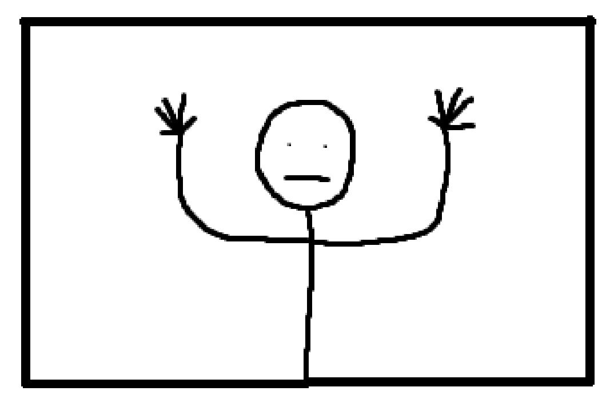
- HellYeah
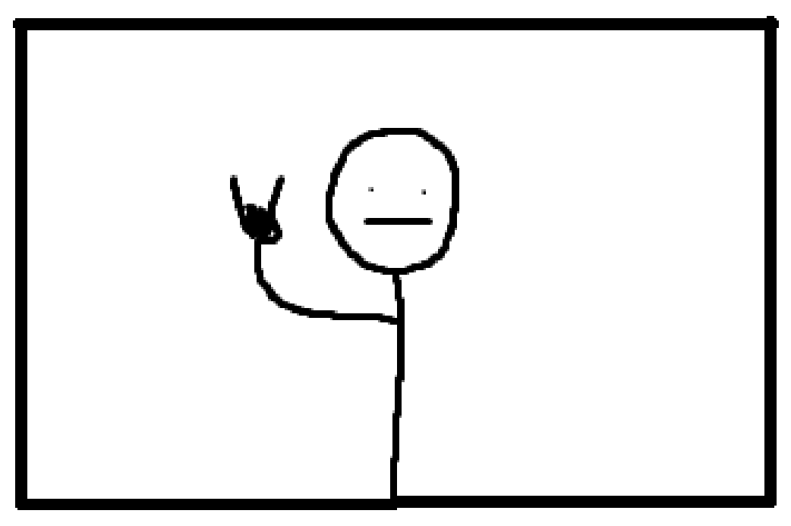
- Josh
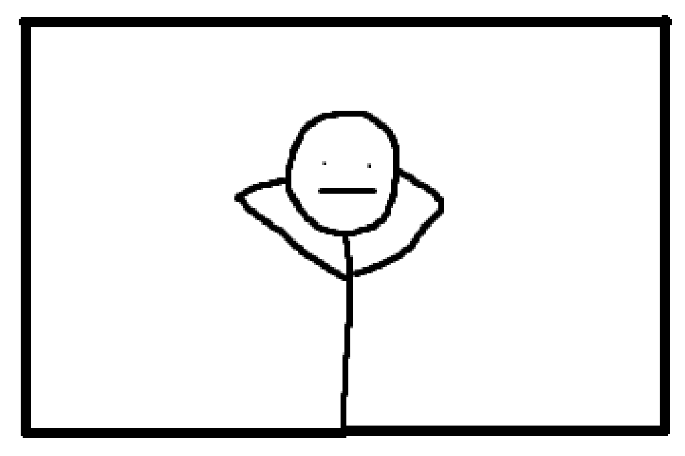
- Nerd
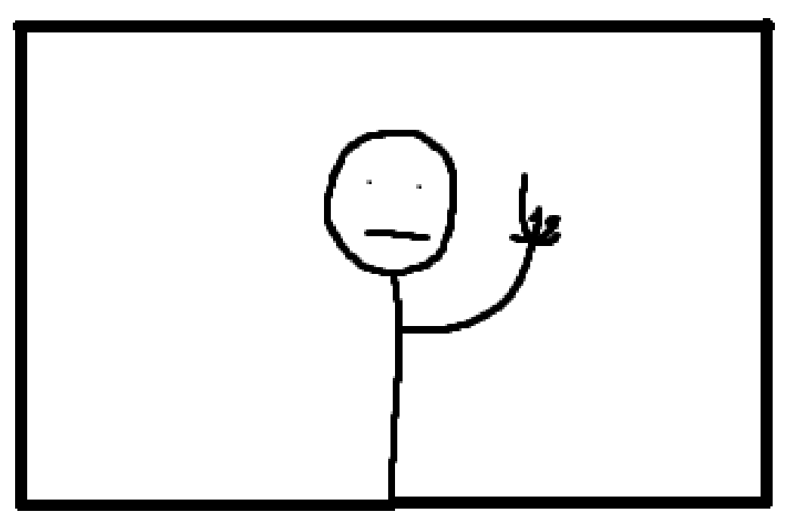
- Pouce (Thumbs up)
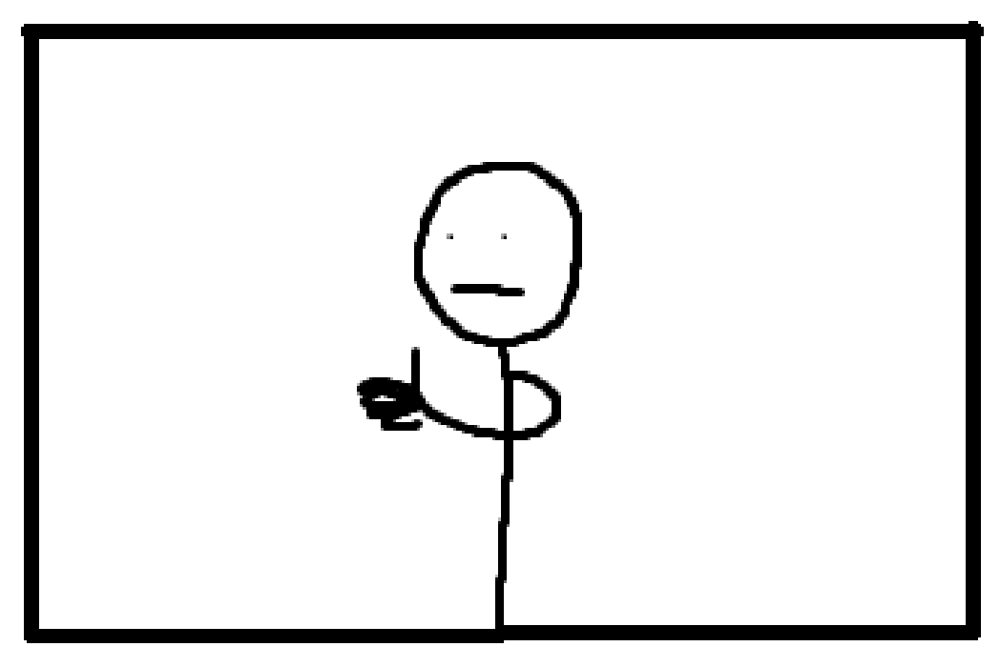
- rien (Nothing/Neutral)
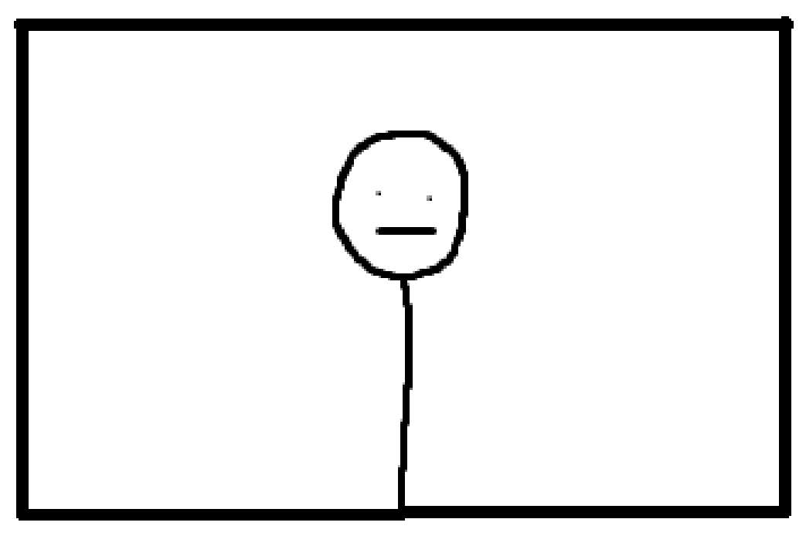
- Silence
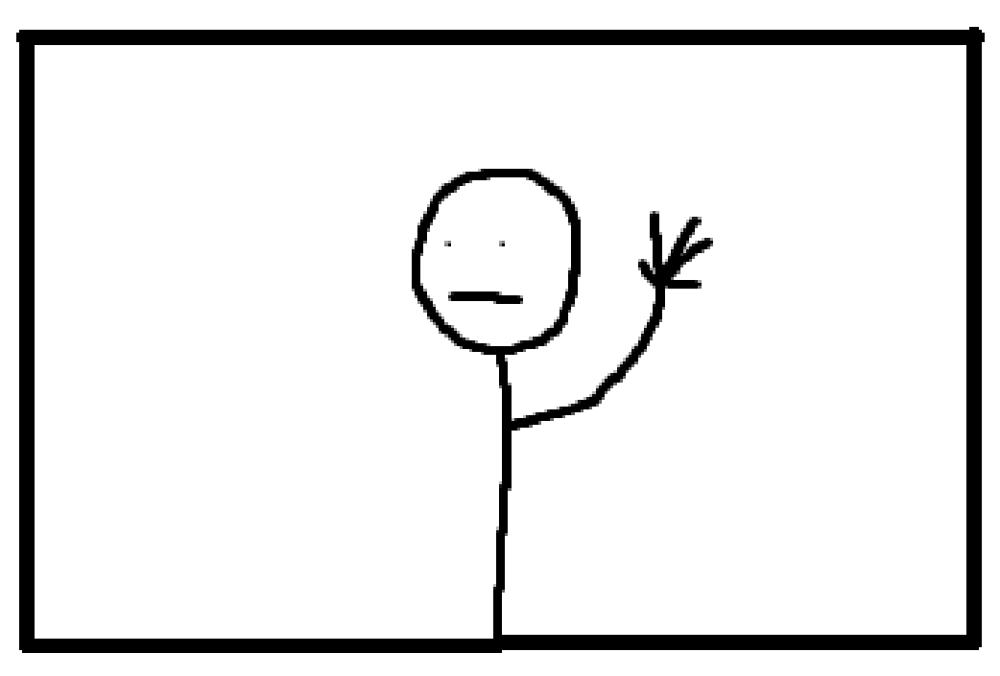
- Uwu
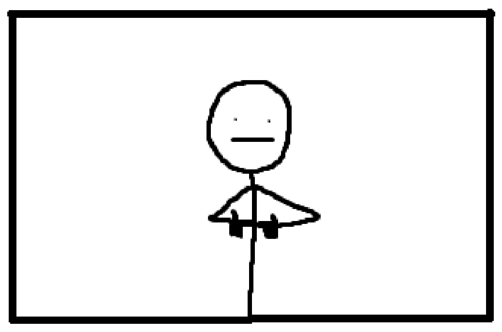
- Ellie (Ellie smile meme)
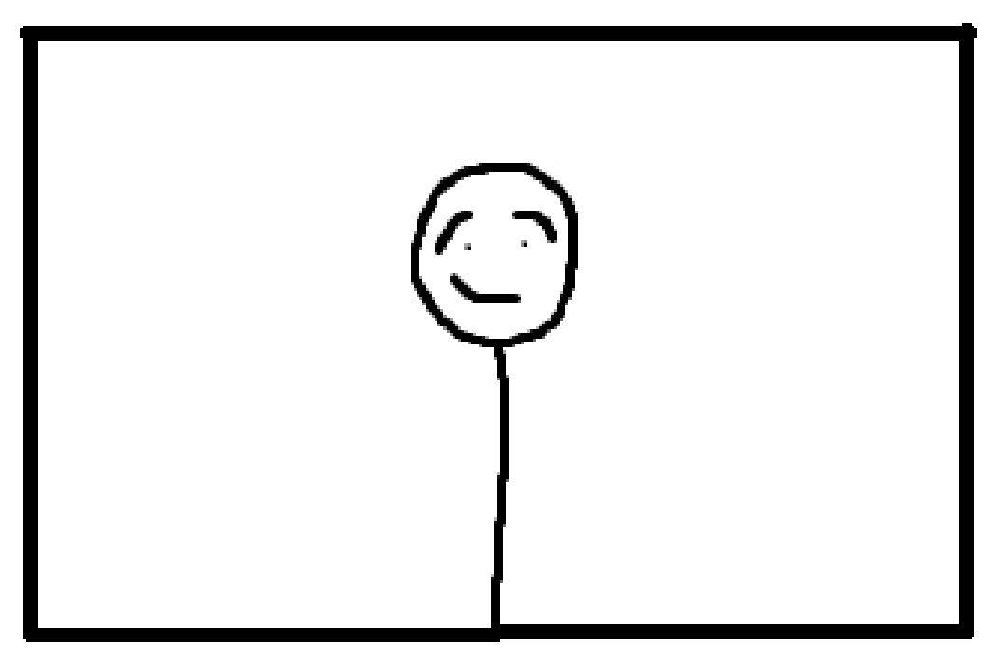
- TheRock (Eyebrow)
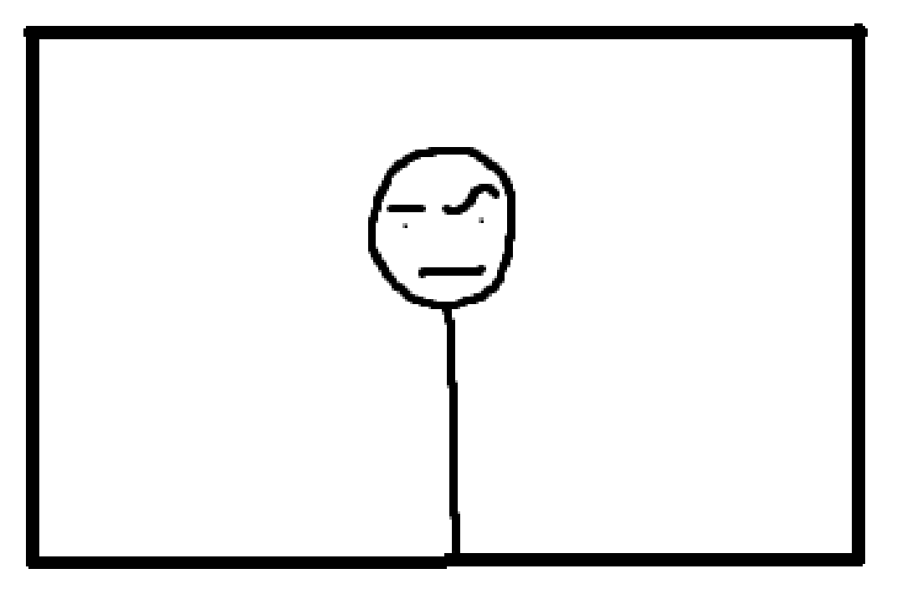
- AngryEmoji (Anger + Fist)
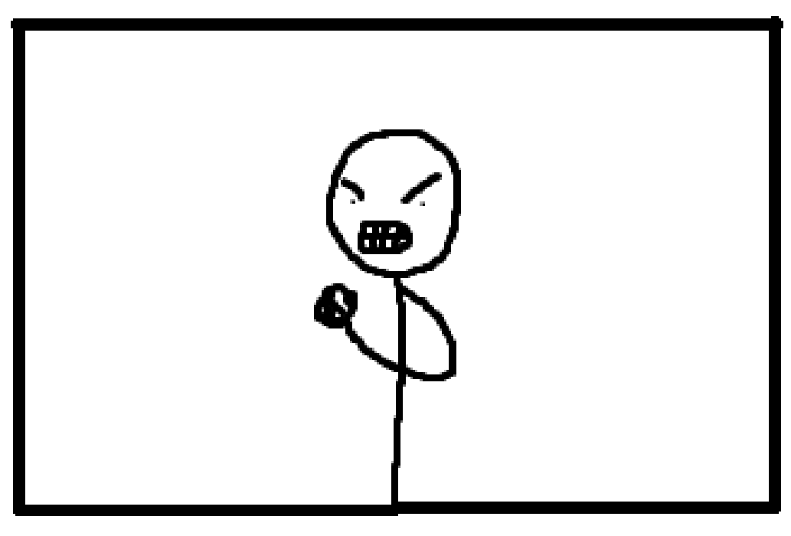

You can use your own pictures to train the model, or you can simply use the already existing "memotron_model.pth" or csv file to re-train the model.
